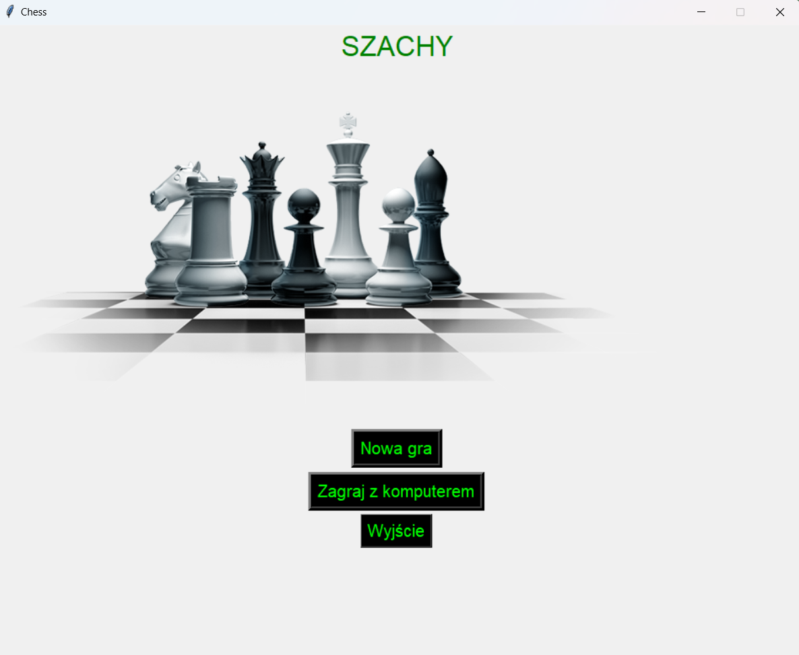
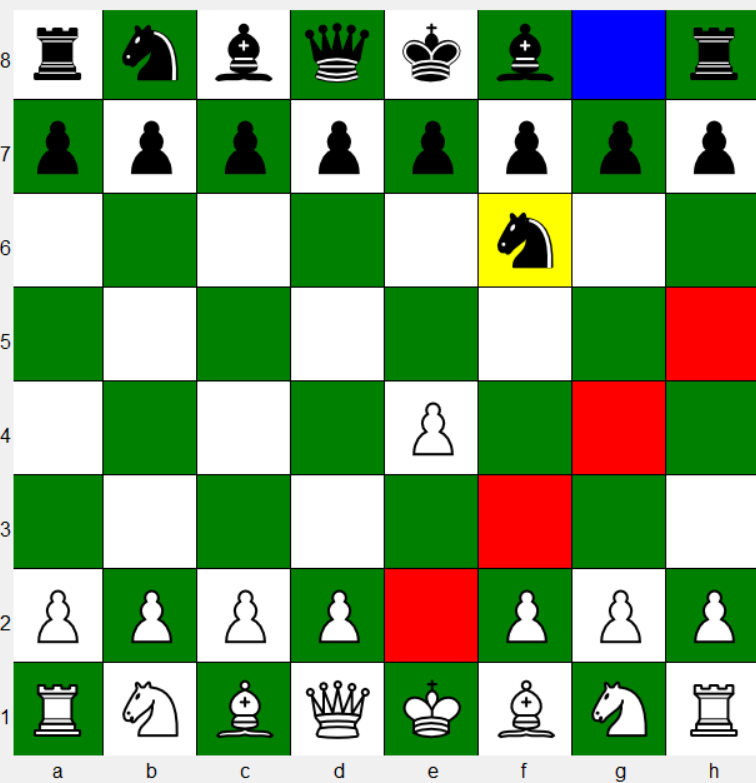
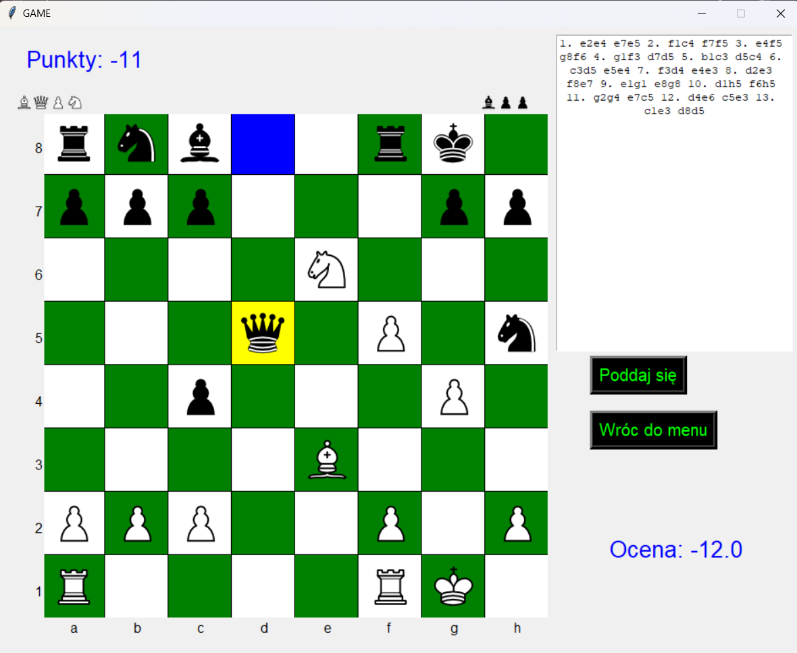

# Aplikacja do gry w szachy z silnikiem szachowym

## 1. Jak uruchomić?

### Sklonuj repozytorium:
git clone https://github.com/JakubJakubczak/Chess.git
### Wejdź do folderu:
cd Chess
### Uruchom aplikację(python musi być zainstalowany):
python main.py

## 2. Wprowadzenie
Celem projektu było stworzenie aplikacji do gry w szachy w Pythonie, wykorzystując bibliotekę Tkinter do interfejsu graficznego (GUI) oraz klasyczny silnik szachowy oparty na algorytmie Negamax z optymalizacją alfa-beta. Aplikacja umożliwia grę z komputerem, oferując:
- **Interfejs graficzny**: Szachownica z możliwością przeciągania figur, menu z opcjami (nowa gra, wybór silnika, ustawienia), wyświetlanie punktów, zbitych figur, oceny pozycji i historii gry w formacie LAN.
- **Logika gry**: Zasady ruchu figur, generowanie możliwych ruchów, wykonywanie ruchów.
- **Silnik szachowy**: Ocena pozycji oparta na wartości figur i parametrach pozycyjnych, zoptymalizowany algorytm Negamax z cięciami alfa-beta.
## 3. Interfejs graficzny
Aplikacja zawiera menu główne, a po wyborze trybu gry wyświetla się ponumerowana szachownica z menu gry, gdzie bierki można przesuwać za pomocą myszy.

### Menu główne

  

### Szachownica

  

### Szachownica wraz z menu gry

  

## 4. Najważniejsze metody aplikacji
W celu realizacji logicznej części aplikacji zostały zaimplementowane metody takie jak m.in:
- **sprawdzanie szacha**,
- **sprawdzanie mata**,
- **sprawdzanie remisu(pat, zasada 50 posunięć, niewystarczający materiał)**,
- **generowanie możliwych ruchów dla każdej bierki(uwzględniająć roszadę króla, promocję piona i bicie w przelocie)**,
- **generowanie wszystkich możliwych ruchów dla gracza**,
- **wykonywanie ruchu**,
- **cofnięcie ruchu**.

## 5. Silnik szachowy
Silnik szachowy opiera się na przeszukiwanie możliwych ruchów za pomocą algorytmu negamax oraz ocenie pozycji przy użyciu ręcznie pisanych heurystyk. Stan gry reprezentowany jest za pomocą dwuwymiarowej tablicy, gdzie figura określana jest za pomocą liczby całkowitej, np. 9 dla hetmana koloru białęgo i -9 dla hetmana koloru czarnego.

### Negamax
Algorytm negamax został usprawniony o cięcia alfa-beta oraz szeregowanie ruchów. Cięcia alfa-beta znacząco usprawniły przeszukiwanie drzewa. W celu przyspieszenia obliczeń zaimplementowano również szeregowanie ruchów, które spowodowało pierwszeństwo w obliczaniu ruchów obiecującyh, takich jak np. bicie bierki czy promocja piona, co prowadzi do jeszcze większej ilości cięc.

### Ewaluacja pozycji
Ewaluacja pozycji odbywa się za pomocą 3 kryteriów:
-stan materialny bierek na planszy obydwu graczy(Suma wag bierek),
-pozycja bierek na planszy,
-mobilność bierek.

## 6. Wyniki
Poziom silnika szachowego został przetestowany na platformie chess.com, gdy jego głębokość była równa 3 i został sklasyfikowany na około 1100 oczek rankingowych. Plasuje go to na poziomie średniozaawansowanym. Silnik jest w stanie działać na głębokośći 5, natomiast czas liczenia jednego ruchu osiąga nawet minutę, dlatego silnik był testowany jedynie na niskiej głębokości.
